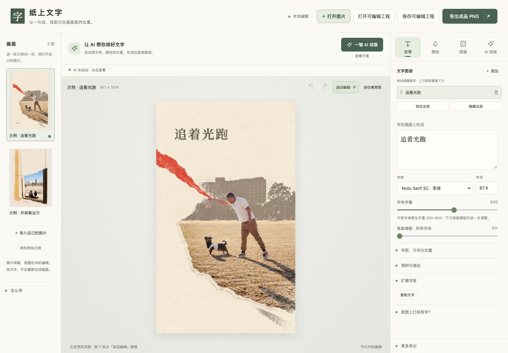

# 纸上文字 · Paper Lettering

**让照片上的文字，可以自由修改。**

An offline typography editor for photos and paper collages, with editable Chinese and English text, print textures, and optional AI layout through your own ChatGPT/Codex account.

[下载 v0.6.0 试用版](https://github.com/aychdong/paper-lettering/releases/tag/v0.6.0) · [使用指南](使用指南.md) · [连接自己的 ChatGPT](AI-CONNECTION.md) · [许可范围](THIRD_PARTY_NOTICES.md)



画面完成后，标题还可以改。拖动、旋转、放大文字，换一种字体、颜色和纸上质感，再保存成可继续编辑的工程。离线编辑无需账号，也不必为了改一句文案重新生成整张图片。

## 三步开始

1. 从 [Releases](https://github.com/aychdong/paper-lettering/releases/tag/v0.6.0) 下载 **Paper-Lettering-0.6.zip**，解压完整文件夹。
2. 用近期 Chrome / Edge 打开 **纸上文字.html**。首次进入已有两张排好文字的示例，可以直接尝试。
3. 顶部点 **打开图片** 导入自己的作品；完成后用 **保存可编辑工程** 留存参数，或 **导出成品 PNG**。

保存的 `.paper.json` 包含底图、独立文字层、参数和用到的字体；PNG 是合并后的成品。浏览器自动草稿只是方便继续编辑，请保存工程作为备份。

## 你可以做什么

| 编辑内容 | 能力 |
| --- | --- |
| 文字与字体 | 中文/英文、12 款内置字体、字重、笔画增粗、倾斜、描边、字距与行距 |
| 位置与图层 | 拖动移动、四角缩放、旋转、拖拽排序、锁定、隐藏、删除、撤销与重做 |
| 颜色 | 图片取色、色值输入、本地色彩候选、可选 AI 看图推荐 |
| 纸上质感 | 油墨、褪色、铅笔、印章等 9 种视觉效果 |
| 整体预览 | 按 P 隐藏辅助框，查看完整画面 |
| AI 排版 | 一键初排、两套方案、配色理由、工作阶段与计时；结果仍可编辑和撤销 |

右侧只有 **文字 / 颜色 / 质感 / AI 排版** 四个标签页。进阶参数按需展开，图层区保持可见。

## 两张开箱即用的示例

- **追着光跑**：人物与宠物的动感拼贴，上方横题搭配暖墨褐。
- **并肩看远方**：保留人物与空间关系，在纸面留白上安放标题。

每张都已应用一套真实 AI 推荐，并保存另一套版式、配色和中文理由。**查看、切换和编辑这些已有方案不需要 AI 账号，也不联网。** 示例仅按个人非商业范围提供，详情见下方许可说明。

## 可选：用自己的 ChatGPT 连接 AI

1. 安装 Python 3.9+ 和官方 Codex CLI。
2. 双击 **连接自己的ChatGPT**，通过官方 Codex 登录流程登录自己的账号。
3. 双击 **启用AI助手**，使用新打开的页面；看到「AI 已连接 · ChatGPT」后即可请求。

本项目不提供共享账号或额度，也不要求把密码、API Key 或登录令牌交给作者。网页 ChatGPT 的登录和本机 Codex 登录是两回事。完整步骤与排错见 [AI-CONNECTION.md](AI-CONNECTION.md)。

当前支持 **官方 Codex App Server + ChatGPT 登录**。任意 Base URL/API Key、Anthropic、Gemini、Ollama 接入尚未实现。提供方代码与前端分开，扩展约定见 [AI-API.md](AI-API.md)。

## 本地与云端的边界

- 手工编辑、字库、预置方案和 PNG 导出都在本机完成，没有遥测或远程字体。
- 只有请求新的 AI 建议时，才发送最长边不超过 1200px、重新编码去元数据的派生预览，以及文案和排版参数。
- 本机桥接只监听回环地址，使用每次启动生成的随机连接令牌。它调用你自己的官方 Codex 登录，不读取浏览器 cookie。

详见 [PRIVACY.md](PRIVACY.md)。报告问题时请勿上传私人照片、完整工程、账号文件或带 token 的页面地址。

## 平台与已知限制

| 环境 | 状态 |
| --- | --- |
| Apple Silicon macOS + Chrome 153 | 离线编辑、已有账号连接和实际 AI 请求已测试 |
| Windows / Linux | 提供 HTML 和 Python 入口，尚未实机验证 |
| 新账号首次登录 | 使用官方 Codex 流程；调用逻辑有测试，未进行新账号端到端登录测试 |

这是 **0.6.0 试用版**，不是商店公证安装包。离线编辑不需要 Python；AI 连接需要 Python、Codex、网络及账号可用额度。安装组件请使用各自官方渠道。

已有图片中的像素文字不能自动变回真实字体层；本工具支持在合适的空白纸面上做可撤销覆盖。以后生成作品时，推荐先生成无字底图，再用独立文字层排版。文字质感是视觉近似；系统字体跨设备可能替换，内置/导入且使用的字体会随工程保存。

## 从源码构建

源码含固定版本的字体与两张示例，可离线构建，无需 npm 依赖：

```sh
git clone https://github.com/aychdong/paper-lettering.git
cd paper-lettering
python3 scripts/build.py
```

Windows 可将 `python3` 替换为 `py -3`。生成的 HTML 和 ZIP 位于 `dist/`；不要直接打开源码模板 `tools/lettering/index.html`。

```sh
python3 -m unittest discover -s tests -p 'test_*.py'
python3 scripts/audit.py
```

测试覆盖本机连接权限和登录状态保护。`audit.py` 检查示例/字体哈希、图片元数据及常见隐私数据泄漏；自动扫描不能代替人工审阅。

主要目录：`tools/lettering/` 是前端与可选 AI 连接；`examples/` 保存两张底图与预排版参数；`resources/fonts/` 保存字库及原许可；`scripts/` 负责构建和检查。

## 许可与致谢

| 内容 | 许可范围 |
| --- | --- |
| 编辑器原创代码、脚本和原创文字文档 | [MIT](LICENSE)，仅覆盖原创代码与原创文字文档 |
| 12 款第三方字体 | 各自的 SIL Open Font License，保留原文与固定来源 |
| 两张示例、其预置示例工程，以及展示它们的截图 | 仅个人非商业演示与学习；不属于 MIT 代码许可 |

示例底图风格处理使用了 [Zeejay0 / Gathered Scenes Zine](https://github.com/Zeejay0/gathered-scenes-zine-skill) v1.3；其许可第 3(e) 条限制通过该技能产生的输出的商业使用。完整来源、限制和字体许可见 [THIRD_PARTY_NOTICES.md](THIRD_PARTY_NOTICES.md)。编辑器不捆绑该技能的提示词、模板或代码。要商用编辑器，请使用你有相应权利的自有素材，并移除这里的示例及相关截图。

本项目与 OpenAI、字体作者及 Gathered Scenes 作者无赞助或隶属关系。欢迎报告问题和提交改进；请参阅 [CONTRIBUTING.md](CONTRIBUTING.md)。
